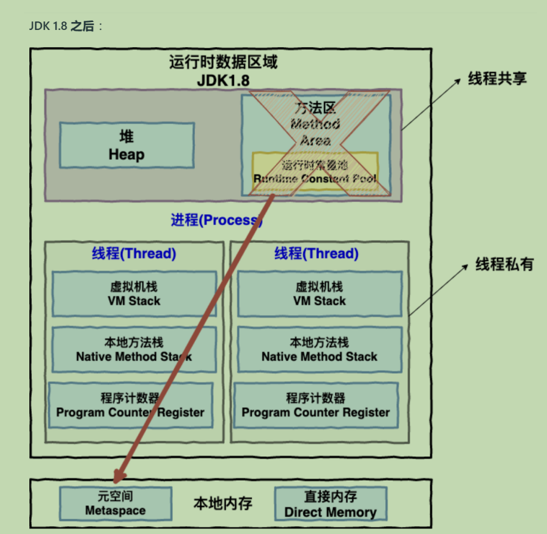

 
JVM内存结构中哪些是线程私有的?哪些是内存共享的?
认知层级
- L1 能背出来
- L2 能画出内存结构图
- L3 能解释现象
- L4 能反设计
> L1 程序计数器PC和虚拟机栈是线程私有的;堆和方法区是内存共享的。

> L2  

> L3 

> L4

## 选择性阅读
简介JDK1.6和JDK1.8方法区的实现的不同和相同点\
\
思路:为什么要求线程私有?为什么要求内存共享?\

>程序计数器:\
简单介绍程序计数器的本质作用和在并发线程中的作用，并简述因此形成的性质

>虚拟机栈\
简介虚拟机栈和进程的关系并举例虚拟机栈的应用场景，

>本地方法栈\
简述本地方法栈的明命名原则和作用

### 线程共享的：

>堆：\
简介一下堆的性质，简述逃逸分析但没有指明逃逸和逃逸分析的定义\
简述堆的应用场景并在垃圾回收维度衡量java堆\

>方法区:\
简述jdk1.6和jdk1.8的方法区的不同实现方式和存储数据类型的相同点和相异点\