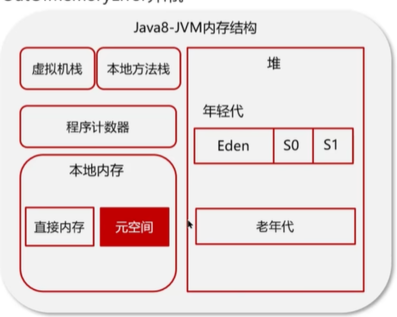
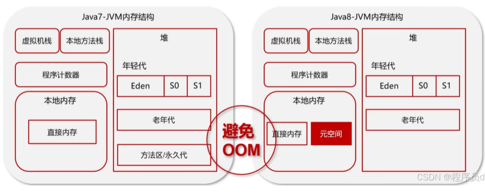

> java堆是线程共享的内存
> 向堆内添加对象实例可能产生堆溢出OutOfMemoryError
> 堆内一般存储数组和实例对象
> java8内存结构图 
> java7内存结构图
## 介绍一下java堆
java堆是线程共享的一片内存空间，这片内存存储数组和实例对象，当创建实例对象且堆内存不足时，引发OutOfMemoryError(栈会引发栈OutOfStackError)
JVM的内存结构图如上，包括虚拟机栈、本地方法栈和程序计数器等线程私有的内存区域，堆内存、方法区和本地内存等内存共享区，本地内存又包括直接内存和代替方法区的原空间
堆中分为老年代和别的类型(年轻代)这种区分不在于对象的类型和引用数量，只在于对象在经过数轮垃圾回收后是否还在Suvivor区，在就打上老年代的标签，至于老年代和年轻代在各方面的区别我就不得而知了

> 每个线程运行所需要的内存空间就叫虚拟机栈，执行先进后出的原则，那么为什么先进后出不是先进先出?

了解一个假设的事实：线程调用方法A时会创建栈帧存储A方法的一些相关信息(我也不清楚都有啥,好像有方法调用参数),然后将栈帧入栈\
方法A在执行过程中调用方法B,同理将B的栈帧入栈,方法B调用方法C······，在C结束之前B结束是不可能的,A也不会结束,结束就意味出栈，因此C出栈即最后入栈的栈帧出栈之前别的栈帧不被允许出栈
> 每个栈由多个栈帧组成，对应着每次方法调用时所占用的内存。栈帧存储什么信息(大概是和方法有所对应的)?

局部变量表、操作数栈、帧数据、对象引用指针
> 每个线程有且只有一个活动栈帧，对应着正在执行的方法。这里的方法和我在java代码里定义的方法有关联吗?

每个方法在java字节码就是一个Method_info,每次线程真正调用方法时,JVM就会根据所调用的方法为本次调用制作栈帧,然后把栈帧压入线程的私有栈即可,字节码文件存在堆里面还是栈里面?
## 介绍一下虚拟机栈
虚拟机栈是线程私有的，先进后出;虚拟机栈是由一个个栈帧组成的;每个线程有且只有一个活动栈帧;